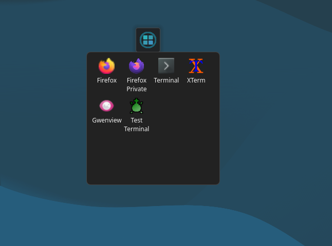
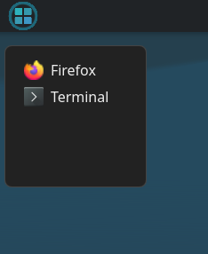
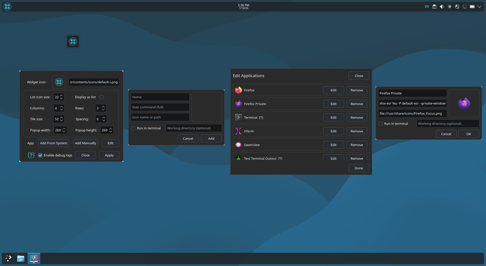

Popup Tile Launcher
====================

Overview
--------
Popup Tile Launcher is a compact Plasma widget that provides a tile-based quick launcher for applications. It combines a QML UI (popup grid and optional list), a per-instance configuration module, and native components (helper and HelperBridge) to perform file operations and safely execute system commands from QML. 

This README explains how to build and install native components, run the helper as a user service or DBus service, the project layout, required dependencies, troubleshooting tips, and licensing.

## Screenshots

<p align="center">
  
  
  
</p>

Requirements and Tested Environment
----------------------------------
Tested on:
- KDE Plasma 6.3.6
- KDE Frameworks 6.13.0
- Qt 6.8.2
- Linux kernel 6.12.43+deb13-amd64
- Graphics platform: Wayland
- OS: Debian GNU/Linux 13

Recommended build dependencies:
- cmake, make, a C++ compiler (g++ or clang)
- Qt6 development packages: QtCore, QtQml, QtQuick, QtQuick.Controls, QtQuick.Layouts, Qt.labs.platform
      sudo apt install qt6-base-dev qt6-declarative-dev \
        qml6-module-qtquick qml6-module-qtquick-controls \
        qml6-module-qtquick-layouts qt6-tools-dev qt6-tools-dev-tools
- KDE Frameworks 6:
      sudo apt install libkf6coreaddons-dev qml6-module-org-kde-coreaddons \
	  libkf6service6 libkf6service-dev libkf6kio-dev
- KDE/Plasma development headers (for QML plugin integration)
      sudo apt install libplasma-dev libkf6package-dev libkf6windowsystem-dev
	  (if available: libkf6plasma-dev)
- Optional: QtDBus or libdbus-1 if DBus is used
- Optional tools: inkscape or rsvg-convert for converting SVG icons to PNG for reliable small-size rendering

Build and Install
-----------------
General build steps for native components (helper and launcher):

1. Ensure dependencies are installed (see above)

2. For each native component, create a build directory and run:

```
mkdir build && cd build
cmake .. -DCMAKE_INSTALL_PREFIX=/usr
make -j$(nproc)
sudo make install
```

Note: when installing to a user directory, set an appropriate `CMAKE_INSTALL_PREFIX`. After installation the `plasma_helper` binary should be available (for example `/usr/bin/plasma_helper` or in the chosen prefix).

3. Install the plasmoid package by placing the `contents` tree under `~/.local/share/plasma/plasmoids/<your-id>/` or by packaging and installing with `plasmapkg`/`kpackagetool5`.
4. Ensure the QML import `org.apps.launcher` (the built plugin) and `imports/org/apps/launcher/qmldir` are installed to a QML import path (system or user imports).

Recommended Installation Paths
------------------------------

Per-user installation (no sudo):
    QML plugin:
        ~/.local/lib/qt6/qml/org/apps/launcher/
        Copy: liborg.apps.launcher.so, qmldir, QML files

    Binaries:
        ~/.local/bin/
        Copy: launcher, plasma_helper

    Example:
        mkdir -p ~/.local/lib/qt6/qml/org/apps/launcher
        cp launcher/build/liborg.apps.launcher.so ~/.local/lib/qt6/qml/org/apps/launcher/
        cp launcher/imports/org/apps/launcher/qmldir ~/.local/lib/qt6/qml/org/apps/launcher/

        mkdir -p ~/.local/bin
        cp launcher/build/launcher ~/.local/bin/
        cp helper/build/plasma_helper ~/.local/bin/

        chmod +x ~/.local/bin/launcher ~/.local/bin/plasma_helper

System-wide installation (all users):
    QML plugin:
        /usr/lib/x86_64-linux-gnu/qt6/qml/org/apps/launcher/

        sudo mkdir -p /usr/lib/x86_64-linux-gnu/qt6/qml/org/apps/launcher
        sudo cp launcher/build/liborg.apps.launcher.so /usr/lib/x86_64-linux-gnu/qt6/qml/org/apps/launcher/
        sudo cp launcher/imports/org/apps/launcher/qmldir /usr/lib/x86_64-linux-gnu/qt6/qml/org/apps/launcher/

    Binaries:
        /usr/bin/ or /usr/local/bin/

Checking Dependencies (ABI compatibility)
-----------------------------------------
Qt6 ABI must match your system Qt version.

Check with:

    ldd ~/.local/lib/qt6/qml/org/apps/launcher/liborg.apps.launcher.so
    ldd ~/.local/bin/launcher
    ldd ~/.local/bin/plasma_helper

If you see “not found”, install missing libraries or reinstall to system paths.

Enabling “Add From System” (.desktop import)
--------------------------------------------
Qt6 blocks XMLHttpRequest on local files by default.

To allow reading /usr/share/applications/*.desktop:

Per-user (recommended):

    mkdir -p ~/.config/plasma-workspace/env
    cat > ~/.config/plasma-workspace/env/enable_qml_xhr.sh <<'EOF'
    #!/bin/sh
    export QML_XHR_ALLOW_FILE_READ=1
    export QML_XHR_ALLOW_FILE_WRITE=1
    EOF
    chmod +x ~/.config/plasma-workspace/env/enable_qml_xhr.sh

System-wide:

    sudo mkdir -p /etc/plasma-workspace/env
    sudo tee /etc/plasma-workspace/env/enable_qml_xhr.sh > /dev/null <<'EOF'
    #!/bin/sh
    export QML_XHR_ALLOW_FILE_READ=1
    export QML_XHR_ALLOW_FILE_WRITE=1
    EOF
    sudo chmod +x /etc/plasma-workspace/env/enable_qml_xhr.sh

Log out and log back in to apply.

Project Structure (example)
---------------------------
The repository/package typically looks like this (relative paths):

```
.local/share/plasma/plasmoids/org.apps.popuptilelauncher/
├── contents
│   ├── config
│   │   ├── config.qml
│   │   ├── kconfig
│   │   │   ├── popup_tile_launcher.kcfg
│   │   │   └── popup_tile_launcher.kcfgc
│   │   ├── qmldir
│   │   └── Utils.qml
│   ├── examples
│   │   ├── example-firefox.desktop
│   │   └── example-terminal.desktop
│   ├── icons
│   │   ├── default-i.png
│   │   ├── help-question.png
│   │   └── icon.png
│   ├── ReadMe.txt
│   └── ui
│       ├── DesktopPicker.qml
│       ├── EditDialog.qml
│       ├── IconPicker.qml
│       ├── main.qml
│       ├── Settings.qml
│       ├── TileGrid.qml
│       └── TileItem.qml
├── helper
│   ├── build
│   │   └── plasma_helper
│   ├── CMakeLists.txt
│   ├── main.cpp
│   ├── PlasmaHelper.cpp
│   └── PlasmaHelper.h
├── launcher
│   ├── build
│   │   ├── launcher
│   │   └── liborg.apps.launcher.so
│   ├── CMakeLists.txt
│   ├── HelperBridge.cpp
│   ├── HelperBridge.h
│   ├── HelperPlugin.cpp
│   ├── HelperPlugin.h
│   ├── imports
│   │   └── org
│   │       ├── apps
│   │       │   └── launcher
│   │       │       └── qmldir
│   │       └── kde
│   │           └── plasma
│   │               └── plasmoid
│   │                   ├── PlasmoidItem.qml
│   │                   ├── Plasmoid.qml
│   │                   └── qmldir
│   ├── Launcher.cpp
│   ├── Launcher.h
│   ├── main.cpp
│   └── resources.qrc
└── metadata.json
```

DBus service and systemd user service for plasma_helper
-----------------------------------------------------
Why: running the helper as a separate user service or DBus-activated service isolates privileged operations (file writes, launching commands) from QML and allows reliable, persistent behavior. The helper can be run as a long-running user daemon or DBus-activated on demand.

Example systemd user service (`~/.config/systemd/user/plasmahelper.service`):

```
[Unit]
Description=Popup Tile Launcher helper
After=network.target

[Service]
Type=simple
ExecStart=/usr/bin/plasma_helper
Restart=on-failure
RestartSec=2
# If the helper should work in a Wayland/X11 environment, you can export environment variables
# Environment=DISPLAY=:0
# Environment=XDG_RUNTIME_DIR=/run/user/1000

[Install]
WantedBy=default.target
```

Enable and start:

```
systemctl --user daemon-reload
systemctl --user enable --now plasmahelper.service
systemctl --user status plasmahelper.service
journalctl --user -u plasmahelper.service -f
```

Example DBus service file (`~/.local/share/dbus-1/services/org.apps.popuptilelauncher.Helper.service`):

```
[D-BUS Service]
Name=org.apps.popuptilelauncher.Helper
Exec=/usr/bin/plasma_helper
```

Place this file in `~/.local/share/dbus-1/services/` or `/usr/share/dbus-1/services/` to allow DBus activation. Choose between a persistent systemd user service or DBus activation depending on whether you want the helper always running or started on demand.

HelperBridge native plugin and API
----------------------------------
Role: `HelperBridge` is the native C++ QML plugin that exposes safe methods to QML, such as `runCommand`, `runCommandInTerminal`, `runDesktop`, `writeInstanceFile`, and `readInstanceFile`. The QML code checks for `HelperBridge` presence and falls back to legacy storage when the bridge is not available.

Typical dependencies for HelperBridge and launcher plugin:
- Qt6 modules: Qt6::Core, Qt6::Qml, Qt6::Quick, Qt6::Gui (as required)
- KDE/Plasma development headers
- Optional: QtDBus or libdbus if the plugin communicates with the helper over DBus
- Build tools: cmake, pkg-config (if used), and a C++ compiler

Best practices:
- Keep the plugin API minimal and well documented.
- Validate inputs in native code and return clear error codes/messages to QML.
- Log errors to stdout/stderr or journal for easier debugging.

Minimal HelperBridge API (example)
---------------------------------
The following is a short, informal reference for the methods the QML expects (adjust names/types to your implementation):

```
// run a shell command (non-interactive)
bool runCommand(string cmd)

// run a command inside a terminal emulator
bool runCommandInTerminal(string cmd, string workingDir)

// launch a .desktop file by path
bool runDesktop(string desktopFilePath)

// write per-instance JSON blob (key = instanceKey)
bool writeInstanceFile(string instanceKey, string jsonText)

// read per-instance JSON blob
string readInstanceFile(string instanceKey)
```

Usage notes: QML code already checks for `HelperBridge` existence and falls back to legacy storage (`store.instancesJson`) when methods are not available. Native implementations should return `true`/`false` or an empty string on failure and log errors for diagnostics.

Usage and Troubleshooting
-------------------------
Usage: after installing the plugin and helper and placing the plasmoid contents in the plasmoids directory, add the widget to a panel or desktop. Use Settings to configure columns, rows, tile size, spacing, and widget icon. The Help button opens `ReadMe.txt` via `Qt.openUrlExternally` with a fallback to `xdg-open` through the helper.

Troubleshooting checklist:
- Icons not found: verify `contents/icons/` contains the expected files and QML uses `Qt.resolvedUrl("../icons/...")`.
- HelperBridge missing: check that the launcher plugin (`liborg.apps.launcher.so`) is installed to a QML import path and that QML can import `org.apps.launcher`.
- Per-instance storage not persisting: ensure the helper (if used) has write permissions and that `_writeInstanceRaw` returns success; check `journalctl --user` for helper logs.
- SVG rendering issues: export a PNG at the target size (42x42) and use that if SVG renders poorly in QML.
- Enable debug logs: set `Utils.debugLogs = true` in runtime or via Settings to get detailed console output.

Quick test commands (examples)
-----------------------------
From QML console or a small test harness you can try (if HelperBridge is available):

```
// test run command
HelperBridge.runCommand("echo hello > /tmp/popup_tile_launcher_test.txt")

// test write/read instance file
HelperBridge.writeInstanceFile("pinst-test", "{\"test\":true}")
var s = HelperBridge.readInstanceFile("pinst-test")
console.log("read instance:", s)
```

## License
This project is licensed under the MIT License – see the [LICENSE](LICENSE) file for details.

```

Credits
-------
Author: rzxas@outlook.com  
Development assistance: Copilot — QML snippets, configuration logic, icon variants, and build/service guidance.
